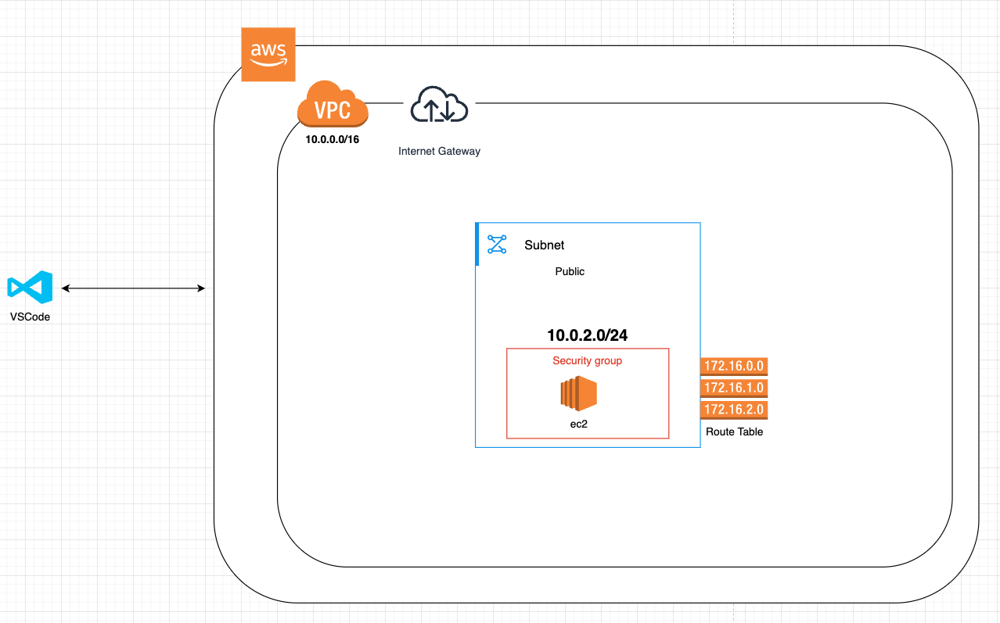
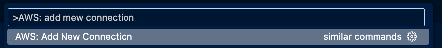
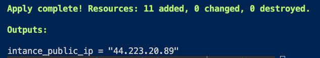
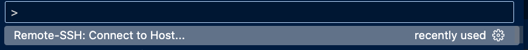

### Bare Minimum Setup of Dev Environment on AWS EC2 for VSCode with Terraform



This Terraform project sets up a basic development environment on an AWS EC2 instance. The provided [`userdata.tpl`](userdata.tpl) script installs Docker and other essential packages, but it can be extended to create a more comprehensive development setup, such as setting up multiple services with Docker Compose and checking out the project's Git repository.

#### Key Parts of the Infrastructure

1. **VPC and Subnet Configuration**:
   - The VPC (`aws_vpc.dev_setup_vpc`) is created with a CIDR block of `10.0.0.0/16` and DNS support enabled.
   - A public subnet (`aws_subnet.dev_setup_public_subnet`) is created within the VPC with a CIDR block of `10.0.1.0/24`.

2. **Internet Gateway and Route Table**:
   - An Internet Gateway (`aws_internet_gateway.dev-setup-igw`) is attached to the VPC to allow internet access.
   - A route table (`aws_route_table.dev_setpup_public_rt`) is created and associated with the public subnet to route traffic to the Internet Gateway.

3. **Security Groups**:
   - A security group (`aws_security_group.dev_setup_security_group`) is created to allow inbound SSH traffic (port 22) from anywhere and all outbound traffic.

4. **Key Pair**:
   - An SSH key pair (`aws_key_pair.dev_auth`) is created using the public key located at `~/.ssh/id_ed25519.pub`.

5. **EC2 Instance**:
   - An EC2 instance (`aws_instance.dev_instance`) is created with the following specifications:
     - Instance type: `t2.micro`
     - AMI: The most recent Ubuntu AMI
     - Security group: The previously created security group
     - Subnet: The previously created public subnet
     - User data: The [`userdata.tpl`](userdata.tpl) script to install Docker and other packages
     - SSH configuration: The `local-exec` provisioner updates the SSH config based on the host OS

#### Extending the Setup

The [`userdata.tpl`](userdata.tpl) script currently installs Docker and other essential packages. However, you can extend this script to create a full development setup. For example, you can:

1. **Set Up Multiple Services with Docker Compose**:
   - Create a `docker-compose.yml` file defining the services required for your development environment.
   - Add commands to the [`userdata.tpl`](userdata.tpl) script to install Docker Compose and start the services.

2. **Check Out the Project's Git Repository**:
   - Add commands to the [`userdata.tpl`](userdata.tpl) script to clone the project's Git repository.
   - Optionally, check out a specific branch or tag and run any necessary setup scripts.

By extending the [`userdata.tpl`](userdata.tpl) script, you can automate the setup of a comprehensive development environment tailored to your project's needs.


## Installation Steps

Follow these steps to set up the developer environment.

#### Install terraform

````
brew tap hashicorp/tap
brew install hashicorp/tap/terraform
````

Confirm the installation

````
terraform --version
````

### Create AWS IAM user

1. Sign in to the AWS Management Console.

2. Navigate to the IAM service and create a new user.

3. Provide a user name and select **Programmatic access**.

4. Attach the necessary policies to the user, e.g., AdministratorAccess.

5. Complete the user creation process and download the `.csv` file containing the **Access key ID** and **Secret access key**. Store this file securely as it contains sensitive information.


#### Install the VSCode extension for AWS

https://aws.amazon.com/visualstudiocode/


#### Add new connection from the VSCode command palette

Press `Shift + Command + P`

 

#### Install Terraform VSCode extension

https://marketplace.visualstudio.com/items?itemName=HashiCorp.terraform

#### Update Your Region, Profile Name, and Path to the AWS Credentials in [`providers.tf`](providers.tf)

```
provider "aws" {
  region                   = "us-east-1"
  shared_credentials_files = ["~/.aws/credentials"]
  profile                  = "dev_setup"
}
```

### Create SSH Key and add it the `aws_key_pair`

Update the path to your public SSH key in the `aws_key_pair` resource in [`main.tf`](main.tf):

```
resource "aws_key_pair" "dev_auth" {
  key_name   = "dev-key"
  public_key = file("~/.ssh/id_ed25519.pub")
}
```

#### Initialize Terraform

````
terraform init
````

#### Plan the Terraform Resources

````
terraform plan
````

#### Create the Infrastructure

````
terraform apply --auto-approve
````

#### To destroy the Infrastructure

````
terraform destroy --auto-approve
````

### SSH to the EC2 instance

Once Terraform is done creating the infrastructure, you will see the public IP of your EC2 instance in the output like this:



```
ssh <ec2-instance-public-ip>
```

Terraform already updated the SSH config using the local-exec, so the SSH config for your instance should be there.

#### Install VSCode Remote SSH extension

https://marketplace.visualstudio.com/items?itemName=ms-vscode-remote.remote-ssh

connect to ssh host from command palette

Press `Shift + Command + P`



Select ec2 instance IP


This will open a new window of VSCode with the project view of your remote Ubuntu server

You can also find the IP with theses commands:

```
terraform state list
```

```
terraform state show aws_instance.dev_instance | grep public_ip 
```


## Happy Coding 🚀 🧑‍💻 👩‍💻
